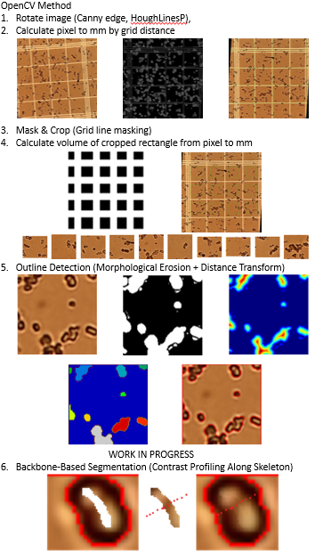
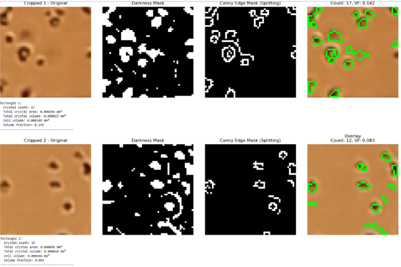

# SLAC Crystal Segmentation Pipeline

Automated crystal detection and size assessment for fixed-target serial crystallography experiments at SLAC National Accelerator Laboratory (LCLS / MFX instrument).

Developed as part of the Multi-user High-throughput SSPX project under Dr. Elyse Schriber.

---

## Background

Fixed-target serial crystallography requires depositing protein crystals uniformly across chip arrays — each hole in the chip ideally holds one crystal. This pipeline was built to:

1. Isolate the chip region from raw microscope images
2. Detect individual crystals, including overlapping ones
3. Measure crystal size distribution to assess uniformity across chip arrays
4. Count crystals per well in hemocytometer images for concentration estimation

Two parallel approaches were developed for chip images: a classical ImageJ macro pipeline and a deep learning U-Net. A separate OpenCV pipeline handles hemocytometer grid alignment and crystal counting.

---

## Repo Structure

```
slac-crystal-pipeline/
├── preprocess.py                          # Step 1: circular crop + resize to 1024x1024
├── imagej/
│   └── crystal_detect.ijm                # ImageJ/Fiji: CLAHE + Watershed + particle analysis
├── unet/
│   ├── make_dataset.py                   # Convert LabelMe annotations to image/mask pairs
│   ├── unet_train.py                     # Train U-Net (PyTorch)
│   ├── infer.py                          # Run inference on new images
│   └── sample_annotation.json           # Example LabelMe annotation for reference
├── hemocytometer/
│   └── hemocytometer_pipeline.ipynb     # OpenCV grid alignment + crystal counting
└── results/                             # Example outputs and pipeline screenshots
```

---

## Results

### ImageJ — Fixed-Target Chip Detection
Crystals detected (white overlay) on LaB6 and MI2 protein crystal chips at 20x magnification:



### Hemocytometer — Grid Alignment + Crystal Counting
Canny + Hough grid detection, cell extraction, and contour-based crystal counting:




### Threshold Method Comparison
Multiple thresholding strategies tested on cropped cells (Otsu, Adaptive, Triangle, Yen, Li, Consensus):


---

## Pipeline A — Fixed-Target Chip (ImageJ)

Best for quick batch processing without a labeled dataset.

```
raw images → preprocess.py → imagej/crystal_detect.ijm
```

1. `python preprocess.py --input raw/ --output processed/`
2. Open `crystal_detect.ijm` in Fiji, select input/output folders when prompted

---

## Pipeline B — Fixed-Target Chip (U-Net)

Better for overlapping crystals or when labeled training data is available.

```
raw images → preprocess.py → annotate in LabelMe → make_dataset.py → unet_train.py → infer.py
```

1. `python preprocess.py --input raw/ --output processed/`
2. Annotate images in [LabelMe](https://github.com/labelmeai/labelme) using the polygon tool
3. `python unet/make_dataset.py` (run from the folder containing your .json files)
4. `python unet/unet_train.py`
5. `python unet/infer.py --input processed/ --model unet_model.pth --output predictions/`

---

## Pipeline C — Hemocytometer Crystal Counting

OpenCV-based pipeline for counting crystals in hemocytometer grid images.

Open `hemocytometer/hemocytometer_pipeline.ipynb` in Jupyter and run cells in order.

**Steps:**
1. **Grid alignment** — adaptive Canny + HoughLinesP + DBSCAN clustering, auto-rotation
2. **Pixel-to-mm calibration** — grid spacing measurement (each square = 0.05 mm)
3. **Cell extraction** — grid masking, contour detection, volume calculation (depth = 0.1 mm)
4. **Crystal segmentation** — custom "ant eating" flood-fill with multi-threshold stop zones + watershed
5. **Backbone segmentation** *(work in progress)* — skeletonization to split overlapping crystals

---

## Requirements

**Python**
```
pip install opencv-python numpy torch albumentations tqdm matplotlib scikit-learn scikit-image jupyter
```

**ImageJ**
- [Fiji](https://fiji.sc/)

---

## Limitations

- U-Net trained on small dataset — noisy on unseen chip types
- Watershed struggles with densely clustered crystals
- Inference threshold (0.2) tuned for LaB6 at 20x — may need adjustment for other samples
- Backbone segmentation is incomplete and not fully validated
